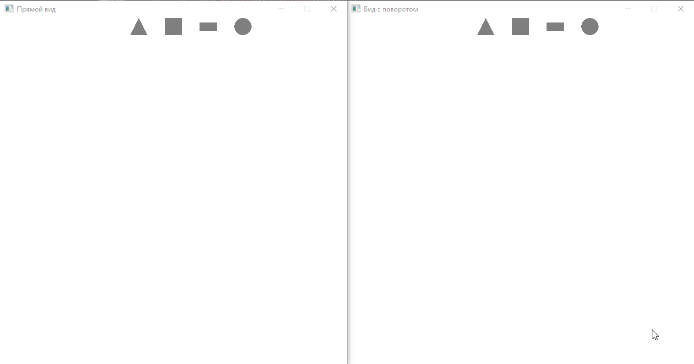

# GLFW Shape Demo

Проект демонстрации геометрических фигур на OpenGL 3.3

Для создания и работы с окнами приложения используется библиотека GLFW. Для доступа к API OpenGL библиотека GLEW.

Для отрисовки примитивной графики используется базовый функционал OpenGL, без создания графического конвейера. 

## Демонстрация работы

По нажатию на кнопку вверху экрана создается соответствующая фигура. Если фигур больше 10, самые старые удаляются. Приложение демонстрирует вид на одну и ту же сцену с 2 ракурсов: прямой вид и с наклоном 45 градусов.